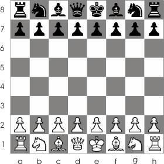
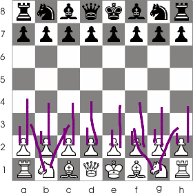

# About the Repository

This repository aims to implement and explain basic concepts of machine learning.  
The README.md in each folder will explain how each concept works.  
Most concepts comes with an implementation in c and comes with a Makefile.  
The visualization is thanks to the great program gnuplot.  

This repository is a work in progress and may have spelling mistakes (sorry :P)  
Also know that nothing here is as highly optimized as the hard working people
  that maintain machine-learning libraries and you probably would want to use
  their implementations or modify this to be faster and more portable.

Also since we use gnuplot you must be careful and follow their Copywrite when using and
especially if modifying this repository.

In order to keep an easy to read structure, the build process currently features 
recursive make calls. If you have ever read Peter Miller's 
it is a potentially slow build structure but it is all for the sake of clarity so please forgive me.

# Machine Learning

This README will also serve as the introduction to machine learning and starts below.

As with every explanation, I will ask the rhetorical question, "What is machine learning?"  
I like to think of machine learning as the science of getting a computer to learn from experience.  
But more technically it is a field of study about algorithms that learn from data.  
And for the sake of clarity I will provide an example.  

Lets say we are trying to write a chess bot.  

A very common way of implementing a chess bot is to have the bot calculate every possible outcome on the board.  
For example, in the beginning each player has 20 possible moves.  

If our bot looks 1 move ahead, each player can make 20 possible moves so we have 20 * 20 = 400 possible outcomes.  
Logically, the best move will have the highest chance of a good outcome so calculating all the outcomes is useful.  
But looking only 1 move ahead will not be as good as looking 2 or 3 moves ahead.  
That is why most chess bots look more than 1 move ahead.  
The problem is that the more moves ahead you look, the more outcomes there are to calculate.  

| Moves |  Outcomes  |
|:-----:|:----------:|
|   1   |     400    |
|   2   |   72,084   |
|   3   | 9+ Million |
|   4   |288+ Billion|
|  ...  |     ...    |
|   40  |More electrons than in the universe|

I think after 4 moves, most computers would start lagging and overheating.  
So the explicit approach to a chess bot would probably look ~3 moves ahead and choose the best move.  

Now faced with robots that calculate 9 million positions and 3 moves ahead, humans have begun to lose. 
But the greatest human players can still put up a fight.  
Grandmasters are human and can only look at a very small fraction of the outcomes a computer can.  
Yet they can compete with a bot calculating 9 million positions and 3 moves ahead.  
That is because when humans look at the chess board, they only consider 2-3 out of these 20 moves.  
Let us look at how humans narrow it down to 2-3 moves.  

Imagine we play our first chess game ever, only knowing the basics.  
We dont know what move to choose in the beginning, so we look at a few of our options and choose one with very little thinking.  
Eventually we repeat the process every turn and lose.  
Then we decide to try again hoping to win.  
And after losing multiple times we begin to get better and better.  
We begin to see what moves are reasonable and what moves are not.  
The accumulated experience lets us get better and better.  

I assume that we can agree that more experience leads to a better understanding of the game.  
So let us make our chess bot learn from playing.  
Let it play game after game after game, gradually changing the way it plays on whether it did well or not last game.  
Eventually, if we implemented it correctly, the chess bot will begin to get good at chess.  
And tying it all back, our new chess bot would be an example of machine learning.  
It uses experience (chess games) to learn how to do something (play chess).  

Further on in this repository we will go more into depth about how experience can be converted into numerical data and how
there are different ways for a computer learn from data.
