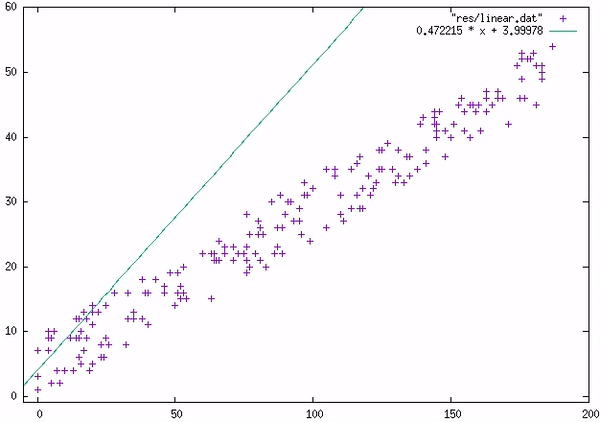

# Linear Regression

Linear Regression wants to do the Following

       we have a bunch of points
       we want to find a line connecting those points
       so we want to get the correct y = mx + b (yes math I am sorry)

       For example we have the following

     4 |        o
     3 |
     2 |    o
     1 |  o
     0 |_ _ _ _ _
        0 1 2 3 4

       as you can see the points are (1, 1), (2,2), and (4,4)
       and we can all tell the line between these points is y = x (like below)

     4 |        /
     3 |      /
     2 |    /
     1 |  /
     0 |/ _ _ _ _
        0 1 2 3 4

        but what if the points aren't on a straight line?

     4 |      o
     3 |
     2 |    o
     1 |o
     0 |_ _ _ _ _
        0 1 2 3 4

       our new points are (0, 1), (2, 2), (3, 4)
       so how are we supposed to get a straight line for that?

       we have to set m and b from y = mx + b
       so lets start by making a guess for the line like y = x

     4 |      o /
     3 |      /
     2 |    o
     1 |o /
     0 |/ _ _ _ _
        0 1 2 3 4

       turns out that is an decent guess
       but obviously our guess is not perfect

       so just how wrong is our guess?

       well each point has a distance from the line
       and the bigger the distance the worse our answer is
       so lets calculate just how wrong we are

       because our guess is y = x
       we guess at x = 0 that y = 0
       in reality our guess should give us (0, 1)
       so we are off by 1

       we guess at x = 2 that y = 2
       hey our guess is right so our distance is 0
       so far we are off by 1 still

       we guess at x = 3 that y = 3
       and the point is (3, 4) so we are off of by 1.
       so we are in total off by 2

       so basically our error = all the distances of points from our line added together
       but wait what if a point is below our line

     4 |        /
     3 |    o / o
     2 |    /
     1 |o /
     0 |/ _ _ _ _
        0 1 2 3 4

       our guess is y = x and the points are (0, 1), (2, 3), and (4, 3)
       lets find the error of our line starting from the left

        x  | our guess | actual
       --------------------------
        0  |     0     |   1
        2  |     2     |   3
        4  |     4     |   3

       so we were off by 1, 1, and -1

       wait a minute, that third distance is negative
       just adding them together 1 + 1 + -1 means were we only off by 1
       and that just does not make sense
       there are a few ways to get around this

       We can take the absolute value:
          |1| + |1| + |-1| = 3

       We can take the square of each:
          1^2 + 1^2 + (-1)^2 = 3

       The one taking the square seems more mathy so we will go with that. (some people beg to differ)
       so now our error = all the distances of points from our line squared and then added together

       you know, I just realized something about our error
       it looks exactly like a function that people use
       it takes in our line and the actual points and returns how wrong our line is
       error(our line, actual points) = sum of (each actual point - our line's guess)^2

       so why does it matter that it is a function?
       because a squared function looks like the graph below (sort of)

     4 |\       /
     3 | \     /
     2 |   \ /
     1 |
     0 |_ _ _ _ _
        0 1 2 3 4

       that is what a y = x^2 graph looks like (sort of)
       do you see the lowest point on that graph around (2, 2)?
       that point is called the minimum

       because this is our error we obviously want to minimize it
       and hopefully you can tell the minimum is where we have the least error

       but now how do we get to the minimum?

       there are actually a lot of ways to find the minimum
       but for now I will show you a common way to do it

       the magic to find the minimum is through the math you all know and love. Calculus
       (*cheers everywhere*)

       the way this works is we choose a random point on the graph

     4 |\       /
     3 |  o    /
     2 |   \ /
     1 |
     0 |_ _ _ _ _
        0 1 2 3 4

       as you can see the point needs to move to the right to reach the minimum
       the reason we know this is the slope is pointing that way
       and how do we get slope of a function? through derivatives (yay!)

       so we continuously move in the direction pointed by the derivative
       we will eventually reach our answer

    4 |\       /        4 |\       /        4 |\       /
    3 |  o    /         3 | \     /         3 | \     /
    2 |   \ /           2 |   o /           2 |   \o/
    1 |                 1 |                 1 |    
    0 |_ _ _ _ _        0 |_ _ _ _ _        0 |_ _ _ _ _
       0 1 2 3 4           0 1 2 3 4           0 1 2 3 4

       and we found the minimum.

       but we need to find both m and b in y = mx + b
       so our error graph is not some plebeian 2D graph
       it is a 3D graph but it still works the same way
       you can see all this and more in the actual implementation

And that is how Linear Regression works

The actual implementation follows the same rules but using matrices
I highly recommend to look at why we use matrices so you can understand what is happening

On another note:
The way we found the minimum is actually separate from Linear Regression
it is a method called gradient descent and I will go over it in more detail in another part of this repository
